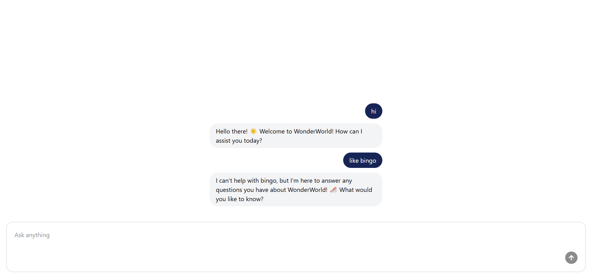

# ChatBot - WonderWorld AI Assistant

A proof-of-concept, full-stack chat application built with React, TypeScript, and Express. Features a specialized AI chatbot trained to answer questions about **WonderWorld**, an imaginary theme park with attractions, ticketing, dining, and more.

## 🎯 About This Project

This is a **demo project** created to learn and explore AI-powered conversational responses using OpenAI. The chatbot specializes in answering questions about WonderWorld's attractions, tickets, dining options, and park information. Built to gain hands-on experience integrating AI capabilities into web applications.

## 🚀 Features

- **WonderWorld Theme Park Assistant** - Specialized AI responses about park attractions, tickets, and information
- **Real-time Chat Interface** - Smooth, responsive messaging experience
- **AI-Powered Responses** - Intelligent conversational capabilities using OpenAI
- **TypeScript Support** - Type-safe code across the entire stack
- **Modern UI** - Built with React and Vite for optimal performance
- **Monorepo Structure** - Organized package management with workspaces

## 📦 Project Structure

```
chat-bot/
├── packages/
│   ├── client/          # React frontend application
│   └── server/          # Express backend API
├── index.ts             # Root entry point
├── package.json         # Root workspace configuration
└── tsconfig.json        # TypeScript configuration
```

## 🛠️ Tech Stack

- **Frontend**: React 19, TypeScript, Vite, Tailwind CSS, Axios
- **Backend**: Express.js, TypeScript, OpenAI API, CORS
- **Runtime**: Bun (all-in-one JavaScript runtime)
- **Package Manager**: Bun Workspaces
- **AI**: OpenAI API for conversational responses

## 📋 Prerequisites

- [Bun](https://bun.com) (v1.3.5 or higher)
- Node.js (for compatibility)

## ⚡ Quick Start

### 1. Install Dependencies

```bash
bun install
```

### 2. Development Mode

Start both client and server in parallel:

```bash
bun run dev
```

Or run them individually:

```bash
# Terminal 1 - Start server
cd packages/server
bun run index.ts

# Terminal 2 - Start client
cd packages/client
bun run dev
```

### 3. Build for Production

```bash
# Build client
cd packages/client
bun run build

# Build server (if needed)
cd packages/server
bun run build
```

## 📚 Documentation

- [Client Documentation](./packages/client/README.md) - React frontend setup and commands
- [Server Documentation](./packages/server/README.md) - Express backend API documentation

## � Screenshots



## 🔧 Available Scripts

- `bun run dev` - Start development environment
- `bun run format` - Format code with Prettier
- `bun run prepare` - Setup Husky git hooks

## 📝 Code Style

This project uses:

- **Prettier** for code formatting
- **ESLint** for code quality
- **Husky** for git hooks

Code is automatically formatted on commit.

## 💡 Getting Help

If you encounter any issues:

1. Check the individual package READMEs
2. Review the project structure
3. Ensure all dependencies are installed with `bun install`

---
